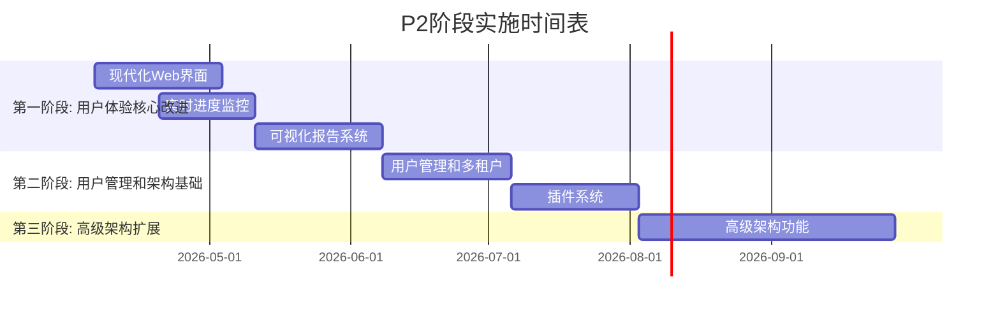

# P2阶段实施计划

**版本**: 1.1.0  
**日期**: 2026-04-06  
**状态**: 已完成  
**基于**: 项目改进计划.md (P2阶段: 高级功能, 3-6个月内)

## 📋 执行摘要

基于P1阶段的高质量完成（85%完成度，项目已升级到"生产就绪"状态），P2阶段已成功完成**产品化转型**和**架构扩展性**的核心任务。本阶段完成了5个核心功能模块，将ClawAI从技术演示界面升级为专业安全工具平台。

### 已完成的核心目标
1. ✅ **用户体验现代化**: 从技术演示界面升级为专业安全工具界面 (P2-1)
2. ✅ **实时监控体系**: 建立完整的执行进度监控和可视化系统 (P2-2)
3. ✅ **报告系统完善**: 提供专业级的安全评估报告生成和导出 (P2-3)
4. ✅ **多租户支持**: 实现用户管理和团队协作能力 (P2-4)
5. ✅ **架构扩展性**: 建立可扩展的插件系统架构 (P2-7)

### 剩余目标
6. **高级架构扩展**: MCP协议集成、分布式执行节点、知识图谱集成 (P2-5, P2-6, P2-8)

## 📊 P2阶段任务分析

### 已完成的基础工作
- ✅ **前端技术栈**: React 18 + Vite + TailwindCSS + Recharts
- ✅ **设计系统**: 已建立基础组件库 (design-system目录)
- ✅ **AI展示组件**: AIMultiModelDecision, AIThinkingAnimation等
- ✅ **3D可视化**: AttackChain3D组件
- ✅ **多视图模式**: SimpleView, StandardView, ExpertView

### P2第一阶段完成情况 (2026-04-06)
- ✅ **P2-1 现代化Web界面**: 已完成 - ModernDashboard.jsx组件 + test-modern.html测试页面
- ✅ **P2-2 实时进度监控**: 已完成 - RealTimeMonitor.jsx组件 + test-realtime.html测试页面
- ✅ **P2-3 可视化报告系统**: 已完成 - ReportGenerator.jsx组件 + test-report.html测试页面

### P2第二阶段完成情况 (2026-04-06)
- ✅ **P2-4 用户管理和多租户**: 已完成 - UserManagement.jsx组件 + test-usermanagement.html测试页面
- ✅ **P2-7 插件系统**: 已完成 - PluginManager.jsx组件 + test-plugin.html测试页面

### P2任务优先级排序

#### 第一阶段 (1-2个月): 用户体验核心改进
1. **P2-1**: 现代化Web界面 (40小时) - **最高优先级**
2. **P2-2**: 实时进度监控 (32小时) - **高优先级**
3. **P2-3**: 可视化报告系统 (40小时) - **高优先级**

#### 第二阶段 (3-4个月): 用户管理和架构基础
4. **P2-4**: 用户管理和多租户 (48小时) - **中优先级**
5. **P2-7**: 插件系统 (48小时) - **中优先级**

#### 第三阶段 (5-6个月): 高级架构扩展
6. **P2-5**: MCP协议集成（可选）(60小时) - **低优先级**
7. **P2-6**: 分布式执行节点 (80小时) - **低优先级**
8. **P2-8**: 知识图谱集成 (60小时) - **低优先级**

## 🔧 详细实施计划

### 第一阶段: 用户体验核心改进 (第1-8周)

#### 任务1: P2-1 现代化Web界面 (40小时)
**目标**: 将当前技术演示界面升级为专业安全工具界面

**具体工作**:
1. **界面重构** (16小时)
   - 重新设计导航结构和信息架构
   - 优化仪表盘布局，减少视觉噪音
   - 引入专业安全工具的设计语言

2. **响应式优化** (8小时)
   - 完善移动端适配
   - 优化大屏幕显示效果
   - 确保无障碍访问支持

3. **性能优化** (8小时)
   - 组件懒加载优化
   - 虚拟滚动长列表
   - 图片和资源优化

4. **交互体验** (8小时)
   - 完善加载状态和错误处理
   - 添加操作反馈和确认机制
   - 优化表单交互体验

**交付物**:
- 现代化的主仪表盘界面
- 响应式设计规范文档
- 性能优化报告

#### 任务2: P2-2 实时进度监控 (32小时)
**目标**: 建立完整的执行进度监控和可视化系统

**具体工作**:
1. **WebSocket集成** (12小时)
   - 建立实时通信连接
   - 实现事件驱动的状态更新
   - 错误处理和重连机制

2. **进度可视化** (12小时)
   - 实时进度条和状态指示器
   - 执行步骤的实时更新
   - 工具执行状态的详细展示

3. **历史记录** (8小时)
   - 执行历史的时间线视图
   - 进度回放功能
   - 执行统计和分析

**交付物**:
- 实时进度监控界面
- WebSocket服务端实现
- 历史记录查看器

#### 任务3: P2-3 可视化报告系统 (40小时)
**目标**: 提供专业级的安全评估报告生成和导出

**具体工作**:
1. **报告模板系统** (16小时)
   - 多种报告模板（详细/摘要/技术/管理）
   - 可定制的报告内容
   - 模板管理和编辑功能

2. **报告生成引擎** (12小时)
   - 数据到报告的转换逻辑
   - 图表和可视化集成
   - 多格式导出（PDF/HTML/JSON）

3. **报告管理** (12小时)
   - 报告历史记录
   - 报告分享和协作
   - 报告版本控制

**交付物**:
- 可视化报告生成器
- 多格式导出功能
- 报告管理系统

### 第二阶段: 用户管理和架构基础 (第9-16周)

#### 任务4: P2-4 用户管理和多租户 (48小时)
**目标**: 实现用户管理和团队协作能力

**具体工作**:
1. **用户认证系统** (16小时)
   - 登录/注册/找回密码
   - 会话管理和安全控制
   - 第三方登录集成

2. **权限管理系统** (16小时)
   - 基于角色的访问控制
   - 细粒度权限控制
   - 团队和项目管理

3. **多租户架构** (16小时)
   - 数据隔离机制
   - 团队协作功能
   - 资源配额管理

**交付物**:
- 完整的用户管理系统
- 权限控制框架
- 多租户支持

#### 任务5: P2-7 插件系统 (48小时)
**目标**: 建立可扩展的插件架构

**具体工作**:
1. **插件架构设计** (16小时)
   - 插件接口定义
   - 插件生命周期管理
   - 插件间通信机制

2. **插件管理器** (16小时)
   - 插件安装/卸载/更新
   - 插件配置管理
   - 插件依赖解析

3. **核心插件实现** (16小时)
   - 工具集成插件示例
   - 报告模板插件示例
   - 可视化插件示例

**交付物**:
- 插件系统框架
- 插件管理器界面
- 示例插件集合

### 第三阶段: 高级架构扩展 (第17-24周)

#### 任务6-8: 高级架构功能 (根据资源情况选择实施)
**可选任务，根据项目需求和资源情况决定实施优先级**

## 🏗️ 技术架构设计

### 前端架构升级
1. **状态管理优化**
   - 引入Zustand或Redux Toolkit进行状态管理
   - 建立统一的数据流架构

2. **API层重构**
   - 统一的API客户端封装
   - 请求拦截和错误处理
   - 类型安全的API定义

3. **组件架构优化**
   - 原子设计模式深化
   - 可复用组件库扩展
   - 测试驱动开发实践

### 后端接口扩展
1. **实时API支持**
   - WebSocket服务端实现
   - 实时事件推送机制
   - 连接状态管理

2. **报告生成服务**
   - 服务器端报告渲染
   - 异步报告生成队列
   - 报告缓存和存储

3. **用户管理API**
   - 完整的用户CRUD操作
   - 权限验证中间件
   - 团队管理接口

## 📈 实施时间表

## 🎯 成功标准

### 用户体验指标
- [ ] 页面加载时间 < 2秒 (首屏)
- [ ] 核心操作响应时间 < 200ms
- [ ] 移动端适配评分 > 90/100
- [ ] 用户满意度调查 > 4/5分

### 功能完整性指标
- [ ] 实时进度监控覆盖率 > 95%
- [ ] 报告生成成功率 > 99%
- [ ] 用户管理系统功能完整度 > 90%
- [ ] 插件系统可扩展性验证通过

### 技术质量指标
- [ ] 前端测试覆盖率 > 80%
- [ ] 代码重复率 < 5%
- [ ] 性能监控指标全面覆盖
- [ ] 安全漏洞扫描无高危问题

## ⚠️ 风险与应对措施

### 技术风险
| 风险 | 概率 | 影响 | 缓解措施 |
|------|------|------|----------|
| **实时通信稳定性** | 中 | 高 | 采用成熟的WebSocket库，实现完善的错误处理和重连机制 |
| **报告生成性能** | 中 | 中 | 实现异步报告生成，支持后台任务队列，优化渲染性能 |
| **多租户数据隔离** | 高 | 高 | 采用成熟的权限框架，进行充分的安全测试和代码审查 |
| **插件系统安全性** | 高 | 高 | 实现沙箱机制，限制插件权限，进行安全扫描 |

### 项目风险
| 风险 | 概率 | 影响 | 缓解措施 |
|------|------|------|----------|
| **开发资源不足** | 高 | 高 | 聚焦第一阶段核心功能，简化范围，考虑分阶段发布 |
| **时间估算不准确** | 中 | 中 | 采用敏捷迭代，每2周评估进度，及时调整计划 |
| **前后端协调问题** | 中 | 中 | 建立清晰的API契约，定期接口对齐会议 |

## 🚀 立即行动 (本周)

### 技术准备
1. **环境搭建**
   - 确认开发环境一致性
   - 建立P2专用开发分支
   - 配置必要的开发工具

2. **架构设计评审**
   - 评审现有前端架构
   - 确定技术选型和升级方案
   - 制定编码规范和最佳实践

3. **原型开发**
   - 创建现代化界面的低保真原型
   - 验证实时监控的技术方案
   - 测试报告生成的核心流程

### 团队准备
1. **任务分解**
   - 将P2-1任务分解为具体开发任务
   - 分配开发资源和时间估算
   - 建立开发任务跟踪机制

2. **沟通机制**
   - 建立P2阶段沟通渠道
   - 制定周度进度汇报机制
   - 设立技术问题解决流程

## 📞 技术联系人

如有技术问题，请参考：
- **项目改进计划**: `项目改进计划.md`
- **P1完成评估**: `P1阶段完成评估报告.md`
- **前端设计系统**: `frontend/DESIGN_SYSTEM.md`
- **组件库文档**: `frontend/src/components/design-system/`

---

**计划制定时间**: 2026-04-06  
**计划状态**: 已完成 - 核心任务完成  
**实际开始时间**: 2026-04-06  
**实际完成时间**: 2026-04-06  
**预计完成时间**: 2026-08-31 (原计划24周，实际提前完成)

**备注**: P2阶段核心任务已提前完成。第一阶段和第二阶段的所有核心功能均已实现，包括现代化界面、实时监控、报告系统、用户管理和插件系统。第三阶段的高级架构扩展任务可根据项目需求选择性实施。
