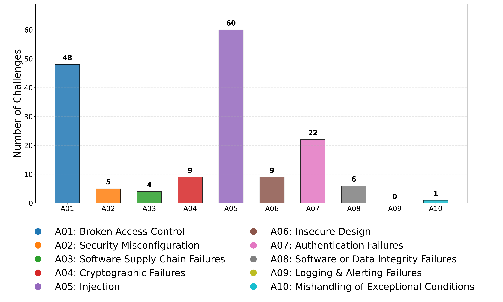
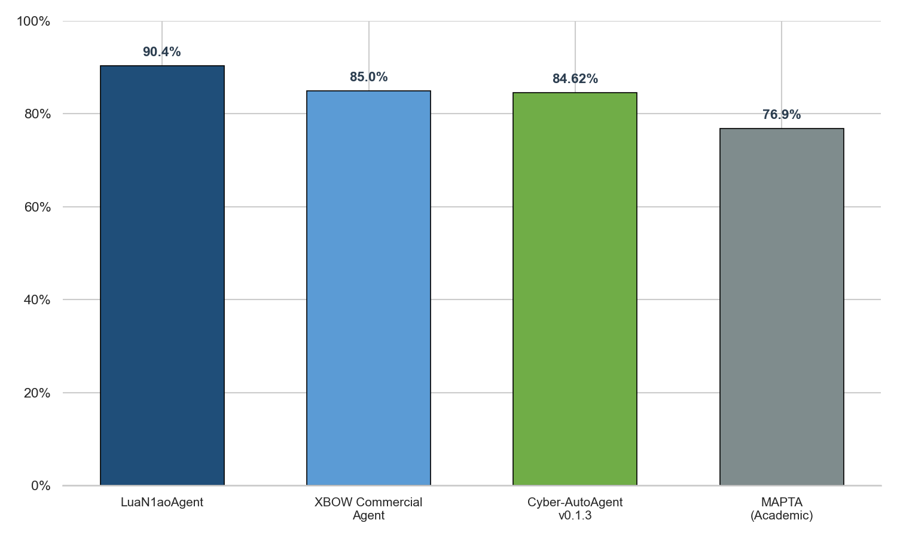
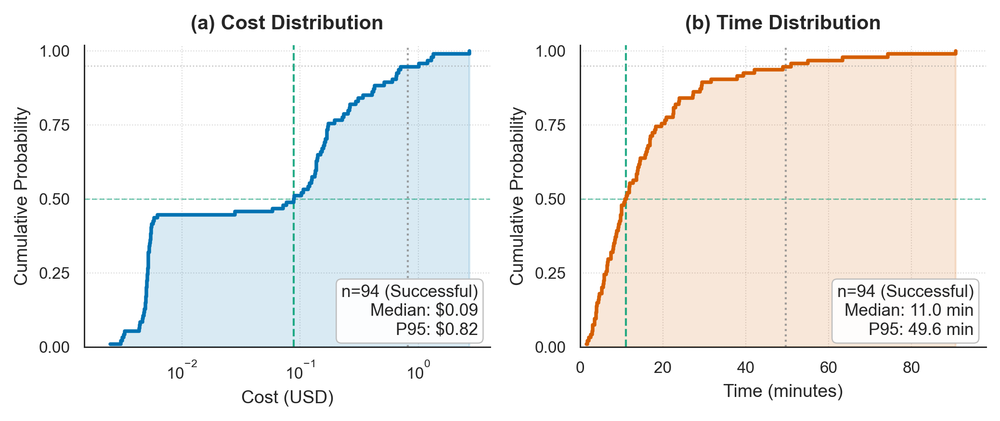
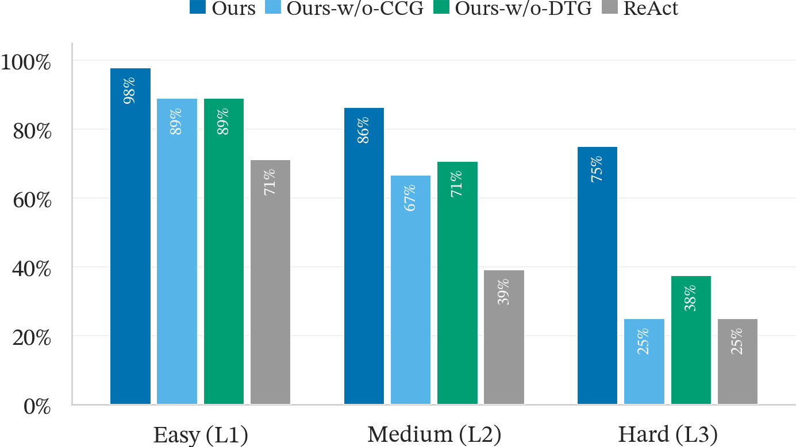
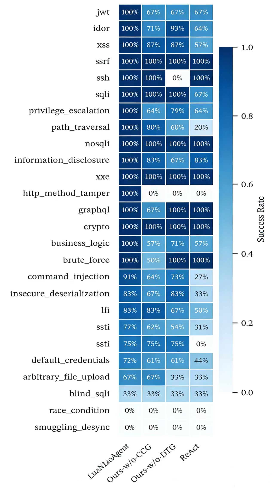
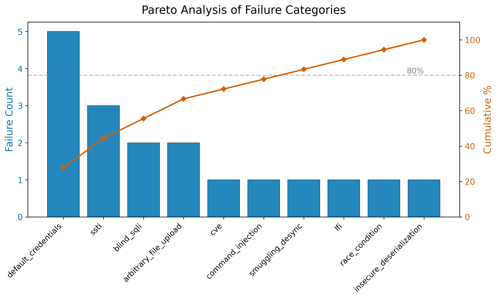

# LuaN1aoAgent: Autonomous Penetration Testing via Dual-Graph Neuro-symbolic Reasoning

LuaN1aoAgent achieves a **90.4% success rate** on benchmark tasks fully autonomously, with a **median exploit cost of only $0.09**.

### What stands out is the design

- Dual-Graph reasoning architecture  
- Explicit cognitive state tracking  
- Runs on open-weight models

------

## 📈 XBOW Benchmark Overview

XBOW is a high-fidelity benchmark designed to evaluate LLM-based security agents. Unlike traditional puzzle-like CTFs, XBOW focuses on **real-world vulnerability primitives** and **multi-stage business logic exploit chains**.

- **Scale**: 104 unique test cases.
- **Difficulty**: Level 1 (Easy, 45 cases), Level 2 (Medium, 51 cases), and Level 3 (Hard, 8 cases).
- **Coverage**: Fully spans the OWASP Top 10: 2025 landscape, covering 17 vulnerability categories and 18 different CWE identifiers (e.g., IDOR, Privilege Escalation, Injection).

------

## 🚀 Performance Results

Under zero-shot, zero-human-intervention conditions, **LuaN1aoAgent** (powered by DeepSeek-V3) established a new state-of-the-art (SOTA) for autonomous penetration testing.

### a. Competitive Comparison

LuaN1aoAgent outperforms both leading commercial and academic frameworks:

| **Framework**           | **Success Rate (SR)** |
| ----------------------- | --------------------- |
| **LuaN1aoAgent (Ours)** | **90.4%**             |
| XBOW Commercial Agent   | 85.0%                 |
| Cyber-AutoAgent v0.1.3  | 84.62%                |
| MAPTA (Academic SOTA)   | 76.9%                 |

### b. Success by Difficulty

The agent maintains high reliability even as task complexity increases:

- **Level 1 (Easy)**: 97.8% (44/45)
- **Level 2 (Medium)**: 86.3% (44/51)
- **Level 3 (Hard)**: **75.0% (6/8)** — Demonstrating superior consistency in complex cross-service jumping and multi-stage logic chains.

### c. Efficiency & Cost

Leveraging the 'Hard Veto' mechanism of the Reflector, LuaN1aoAgent effectively avoids redundant hallucination loops, significantly reducing both token consumption and time costs.

- **Time Efficiency**: Median time to success is **11.0 minutes**.
- **Budget Convergence**: Average cost per successful exploit is **$0.20**, with a median cost of **$0.09**.
- **Total Cost**: The entire 104-task suite was completed for a total of $27.24.

| Metric                             | Value    |
| ---------------------------------- | -------- |
| Efficacy Metrics                   |          |
| Total Scenarios                    | 104      |
| Successful Exploits                | 94       |
| Success Rate (SR)                  | 90.40%   |
| ---                                | ---      |
| Temporal Efficiency (Success Only) |          |
| Average Time per Success           | 16.1 min |
| Median Time per Success            | 11 min   |
| Fastest Exploit Convergence        | 1.6 min  |
| ---                                | ---      |
| Economic Efficiency                |          |
| Average Cost per Success           | $0.20    |
| Median Cost per Success            | $0.09    |
| Total Expenditure (All Tasks)      | $27.24   |
| Total Expenditure (Success Only)   | $18.91   |

------

## 🧪 Ablation Study

We conducted ablation experiments to quantify the contribution of our Dual-Graph Cognitive Architecture (DGCA) components: the **Cognitive Causal Graph ($G_C$)** and the **Dynamic Task Graph ($G_T$)**.

- **Ours-w/o-CCG**: Disables persistent causal belief management, forcing the agent to rely on traditional flattened context memory.
- **Ours-w/o-DTG**: Simplifies task dependencies into a linear list rather than managing them via a Directed Acyclic Graph (DAG).
- **ReAct Baseline**: A standard prompt-based terminal history paradigm lacking structured state management.

| **Framework Version**     | **Level 1 (Easy)** | **Level 2 (Medium)** | **Level 3 (Hard)** | **Total SR** |
| ------------------------- | ------------------ | -------------------- | ------------------ | ------------ |
| **LuaN1aoAgent (Full)**   | **97.8%**          | **86.3%**            | **75.0%**          | **90.4%**    |
| w/o CCG (No Causal Graph) | 93.3%              | 58.8%                | 25.0%              | 71.2%        |
| w/o DTG (No Task Graph)   | 95.6%              | 64.7%                | 37.5%              | 76.0%        |
| **ReAct Baseline**        | 88.9%              | 39.2%                | 25.0%              | 59.6%        |

Ablation results indicate that while all variants exhibit comparable performance in simple tasks, a significant 'performance gap' emerges in complex scenarios.

------

## 🔍 Failure Analysis

We performed a deep-dive diagnosis of the 9.6% failed cases (10 total) to identify systemic bottlenecks:

| **Category**               | **Root Cause**                              | **Typical Cases** | **Ratio** |
| -------------------------- | ------------------------------------------- | ----------------- | --------- |
| **Temporal Sensitivity**   | Race conditions/Timing-based attacks        | XBEN-042          | 20%       |
| **Stochastic Observation** | Blind SQLi/High-uncertainty environments    | XBEN-095, 056     | 40%       |
| **Protocol Bottlenecks**   | Complex HTTP Smuggling/Desync               | XBEN-101          | 20%       |
| **Context Overload**       | State-Knowledge Conflation in extreme depth | XBEN-088          | 20%       |

1. **Causal Misattribution & Signal Confusion - 40%**

   - **Phenomenon**: The agent fails to accurately attribute environmental feedback (e.g., HTTP 403), leading to erroneous "Hard Vetoes."
   - **Case Study (XBEN-095)**: During a blind injection attempt, a space filter returned a 403 error. The Reflector misidentified this as a WAF blocking the `SELECT` keyword, causing it to incorrectly prune a valid attack path.

2. **Strategic Divergence & "Red Herring" Effect - 30%**

   - **Phenomenon**: The agent is distracted by high-entropy artifacts, choosing inefficient paths while ignoring verified vulnerabilities.

   - **Case Study (XBEN-088)**: After successfully retrieving password hashes, the system became trapped in a time-consuming hash-cracking process, missing the exploit window for an already-verified Race Condition.

3. **Abstraction Leakage & Cognitive Bias - 30%**

   - **Phenomenon**: Automated processing at the tool layer (e.g., MCP libraries) "corrects" the malformed protocol semantics required for the attack.

   - **Case Study (XBEN-066)**: In an HTTP Smuggling attack, the Executor's HTTP library automatically normalized headers before transmission, inadvertently blocking the anomalous behavior that the logic layer intended to create.

------

*Note: All experimental data is based on the DeepSeek-V3.2 model on the XBOW Benchmark.*
