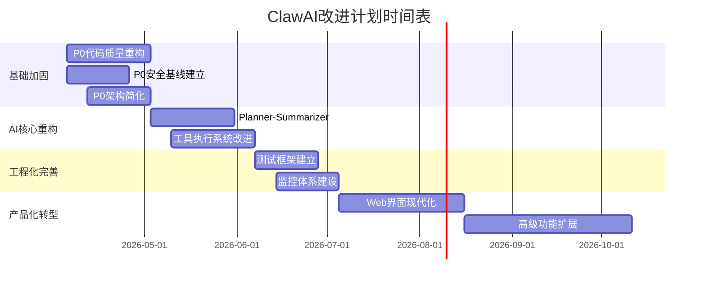

# ClawAI 项目改进计划

**版本**: 1.0.0  
**日期**: 2026-04-05  
**状态**: 草案

## 📋 执行摘要

ClawAI 项目目前处于"技术演示"阶段，集成了多个开源安全工具和AI能力，但缺乏工程深度、产品思维和安全基线。本计划旨在通过 **6个月** 的系统性重构，将项目从"缝合怪"转型为 **可靠、安全、实用的安全评估工具**。

### 核心改进方向
1. **架构简化** - 微服务降级为模块化单体，保留核心隔离
2. **代码质量** - 引入类型安全、错误处理、统一配置
3. **安全基线** - 建立审计日志、访问控制、合规声明
4. **AI核心** - 实现真实的Planner-Summarizer智能循环
5. **用户体验** - 提供真实可用的部署和使用体验

## 🔍 当前问题分析

### 1. 架构设计问题
- **过度复杂**: 小型项目采用完整微服务，运维负担重
- **依赖混乱**: requirements.txt与实际代码依赖不匹配
- **硬编码严重**: 服务地址、配置参数缺乏灵活性

### 2. 代码质量问题
- **导入地狱**: main.py中大量try-catch处理导入失败
- **类型安全缺失**: 滥用`Dict[str, Any]`，无Pydantic模型
- **虚拟类滥用**: DummyMetric掩盖Prometheus配置问题
- **模拟数据**: 攻击路径硬编码，AI能力存疑

### 3. 安全风险
- **工具滥用风险**: 集成攻击工具无使用约束机制
- **密钥泄露风险**: 配置管理可能暴露API密钥
- **法律合规风险**: 渗透测试功能易被用于非法用途
- **审计缺失**: 无完整操作日志，无法追溯

### 4. 工程实践缺失
- **测试为零**: tests/目录空，无任何测试用例
- **文档脱节**: README描述与代码实现不符
- **部署复杂**: Docker配置繁琐但无详细指南

## 🎯 改进目标

### 短期目标 (1-2个月)
1. **代码质量达标**: 类型覆盖率>80%，关键模块单元测试覆盖率>70%
2. **安全基线建立**: 完整的审计日志、访问控制、法律声明
3. **部署流程简化**: 提供真实可用的单机部署方案

### 中期目标 (3-4个月)
1. **AI能力真实化**: 实现HackSynth Planner-Summarizer架构
2. **工具隔离完善**: 每扫描会话独立容器，完整证据链记录
3. **监控体系建立**: 核心指标监控，错误跟踪系统

### 长期目标 (5-6个月)
1. **产品化转型**: 用户友好的Web界面，完整的报告系统
2. **扩展性架构**: 可选分布式执行节点（参考RedAgent MCP）
3. **生态系统建设**: 插件系统，第三方工具集成能力

## 📊 阶段规划

### 阶段0: 基础加固 (第1-4周) - **P0优先级**
**目标**: 建立代码质量基线和安全基线
- 代码类型化和重构
- 安全机制和审计日志
- 简化部署流程

### 阶段1: AI核心重构 (第5-8周) - **P1优先级**
**目标**: 实现真实的AI代理能力
- Planner-Summarizer架构实现
- 工具执行与结果处理
- 反幻觉和验证机制

### 阶段2: 工程化完善 (第9-12周) - **P1优先级**
**目标**: 建立完整的工程体系
- 测试框架和覆盖率
- 监控和可观测性
- 配置管理系统

### 阶段3: 产品化转型 (第13-24周) - **P2优先级**
**目标**: 用户体验和扩展能力
- Web界面现代化
- 报告系统完善
- 插件和扩展系统

## 🔧 具体任务分解

### P0: 紧急修复 (必须立即解决)

#### 1. 代码质量重构
| 任务 | 描述 | 参考项目 | 预计工时 |
|------|------|----------|----------|
| **P0-1** | 引入Pydantic数据模型 | PentAGI | 16小时 |
| **P0-2** | 统一配置管理系统 | PentAGI | 12小时 |
| **P0-3** | 错误处理和日志统一 | PentAGI | 8小时 |
| **P0-4** | 移除硬编码和虚拟类 | - | 8小时 |
| **P0-5** | 依赖关系清理和锁定 | Strix | 6小时 |

#### 2. 安全基线建立
| 任务 | 描述 | 参考项目 | 预计工时 |
|------|------|----------|----------|
| **P0-6** | 完整的审计日志系统 | NeuroSploit | 12小时 |
| **P0-7** | 访问控制和权限模型 | PentAGI | 16小时 |
| **P0-8** | 法律声明和使用条款 | - | 4小时 |
| **P0-9** | 敏感信息脱敏处理 | - | 6小时 |
| **P0-10** | 输入验证和清理 | NeuroSploit | 8小时 |

#### 3. 架构简化
| 任务 | 描述 | 参考项目 | 预计工时 |
|------|------|----------|----------|
| **P0-11** | 微服务降级为模块化单体 | - | 20小时 |
| **P0-12** | Docker配置简化优化 | Strix | 10小时 |
| **P0-13** | 部署文档真实化 | - | 8小时 |

### P1: 核心功能改进 (1-3个月内)

#### 4. AI代理重构
| 任务 | 描述 | 参考项目 | 预计工时 |
|------|------|----------|----------|
| **P1-1** | HackSynth Planner实现 | HackSynth | 24小时 |
| **P1-2** | Summarizer结果处理器 | HackSynth | 20小时 |
| **P1-3** | 命令安全和验证机制 | HackSynth | 16小时 |
| **P1-4** | 多LLM供应商适配 | PentAGI | 20小时 |
| **P1-5** | 记忆和上下文管理 | PentAGI | 24小时 |

#### 5. 工具执行系统
| 任务 | 描述 | 参考项目 | 预计工时 |
|------|------|----------|----------|
| **P1-6** | 每会话容器隔离 | NeuroSploit | 24小时 |
| **P1-7** | 工具执行证据链记录 | NeuroSploit | 20小时 |
| **P1-8** | 反幻觉验证管道 | NeuroSploit | 24小时 |
| **P1-9** | 工具配置管理系统 | - | 16小时 |

#### 6. 工程体系建设
| 任务 | 描述 | 参考项目 | 预计工时 |
|------|------|----------|----------|
| **P1-10** | 单元测试框架建立 | PentAGI | 20小时 |
| **P1-11** | 集成测试套件 | HackSynth | 24小时 |
| **P1-12** | 核心指标监控 | PentAGI | 16小时 |
| **P1-13** | CI/CD流水线 | Strix | 20小时 |

### P2: 高级功能 (3-6个月内)

#### 7. 用户体验改进
| 任务 | 描述 | 参考项目 | 预计工时 |
|------|------|----------|----------|
| **P2-1** | 现代化Web界面 | PentAGI | 40小时 |
| **P2-2** | 实时进度监控 | NeuroSploit | 32小时 |
| **P2-3** | 可视化报告系统 | - | 40小时 |
| **P2-4** | 用户管理和多租户 | PentAGI | 48小时 |

#### 8. 架构扩展性
| 任务 | 描述 | 参考项目 | 预计工时 |
|------|------|----------|----------|
| **P2-5** | MCP协议集成（可选） | RedAgent | 60小时 |
| **P2-6** | 分布式执行节点 | RedAgent | 80小时 |
| **P2-7** | 插件系统 | CyberStrikeAI | 48小时 |
| **P2-8** | 知识图谱集成 | PentAGI | 60小时 |

## 📈 实施时间表

## ⚠️ 风险与应对措施

### 技术风险
| 风险 | 概率 | 影响 | 缓解措施 |
|------|------|------|----------|
| **架构重构影响现有功能** | 中 | 高 | 分阶段重构，保持API兼容性，建立回滚机制 |
| **AI代理效果不如预期** | 高 | 中 | 采用HackSynth验证方案，先实现基础再优化 |
| **安全机制引入复杂性** | 中 | 中 | 优先实现核心安全基线，逐步完善 |
| **性能下降** | 低 | 中 | 性能基准测试，监控关键指标 |

### 项目风险
| 风险 | 概率 | 影响 | 缓解措施 |
|------|------|------|----------|
| **开发资源不足** | 高 | 高 | 聚焦P0优先级，简化范围，考虑社区贡献 |
| **时间估算不准确** | 中 | 中 | 采用敏捷迭代，每2周评估进度 |
| **依赖项目变更** | 低 | 中 | 锁定关键依赖版本，建立兼容性矩阵 |

### 合规风险
| 风险 | 概率 | 影响 | 缓解措施 |
|------|------|------|----------|
| **法律合规问题** | 高 | 极高 | P0阶段必须包含法律声明，明确授权要求 |
| **安全工具滥用** | 中 | 高 | 强化审计日志，实现操作追溯 |
| **数据隐私问题** | 中 | 高 | 数据脱敏，用户数据隔离 |

## ✅ 成功标准

### 代码质量指标
- [ ] 类型注解覆盖率 > 80%
- [ ] 单元测试覆盖率 > 70%
- [ ] 关键模块集成测试覆盖率 > 90%
- [ ] 代码重复率 < 5%
- [ ] 静态分析无严重警告

### 安全指标
- [ ] 完整的审计日志系统
- [ ] 所有敏感操作可追溯
- [ ] 输入验证覆盖所有用户输入点
- [ ] 容器隔离机制正常运行
- [ ] 法律声明明确可见

### 功能指标
- [ ] Planner-Summarizer循环正常运行
- [ ] 支持至少5种安全工具的实际执行
- [ ] 生成可验证的执行证据链
- [ ] 部署流程可在30分钟内完成
- [ ] Web界面基本功能可用

### 性能指标
- [ ] API响应时间 < 200ms (p95)
- [ ] 工具执行成功率 > 95%
- [ ] 系统可用性 > 99.5%
- [ ] 内存使用 < 2GB (基础部署)

## 🚀 后续步骤

### 立即行动 (本周)
1. **成立核心改进小组** - 明确责任分工
2. **建立开发环境** - 统一开发工具和配置
3. **开始P0任务** - 优先处理安全基线和代码质量
4. **制定周度检查点** - 每周五评估进度

### 短期跟进 (1个月内)
1. **完成P0所有任务** - 基础加固
2. **建立CI/CD流水线** - 自动化测试和构建
3. **编写技术文档** - 架构决策记录
4. **社区沟通** - 更新项目状态，寻求反馈

### 中期规划 (3个月内)
1. **完成P1核心功能** - AI代理和工具执行
2. **建立用户测试群** - 收集实际使用反馈
3. **制定发布计划** - 版本管理和发布节奏
4. **考虑开源协作** - 扩大贡献者基础

## 📚 参考项目最佳实践

### 必须采纳的实践
1. **PentAGI工程规范** - CLAUDE.md、类型安全、配置管理
2. **HackSynth算法架构** - Planner-Summarizer双模块循环
3. **NeuroSploit安全机制** - 反幻觉管道、证据链记录
4. **Strix开发体验** - 现代化工具链、容器管理

### 可选采纳的实践
1. **RedAgent MCP协议** - 分布式执行架构
2. **PentAGI知识图谱** - Neo4j关系跟踪
3. **CyberStrikeAI技能系统** - 模块化技能抽象
4. **PentAGI多租户** - 用户管理和隔离

## 🔄 更新日志

| 版本 | 日期 | 修改内容 | 修改人 |
|------|------|----------|--------|
| 1.0.0 | 2026-04-05 | 初始版本创建 | Claude Code |
| 1.1.0 | 2026-04-06 | P2阶段完成：现代化界面、实时监控、报告系统、用户管理、插件系统 | Claude Code |

---

**备注**: 本计划为动态文档，将根据项目进展和反馈定期更新。所有P0优先级任务必须在开始新功能开发前完成。

**核心原则**: 质量优于功能，安全优于便利，真实优于演示。